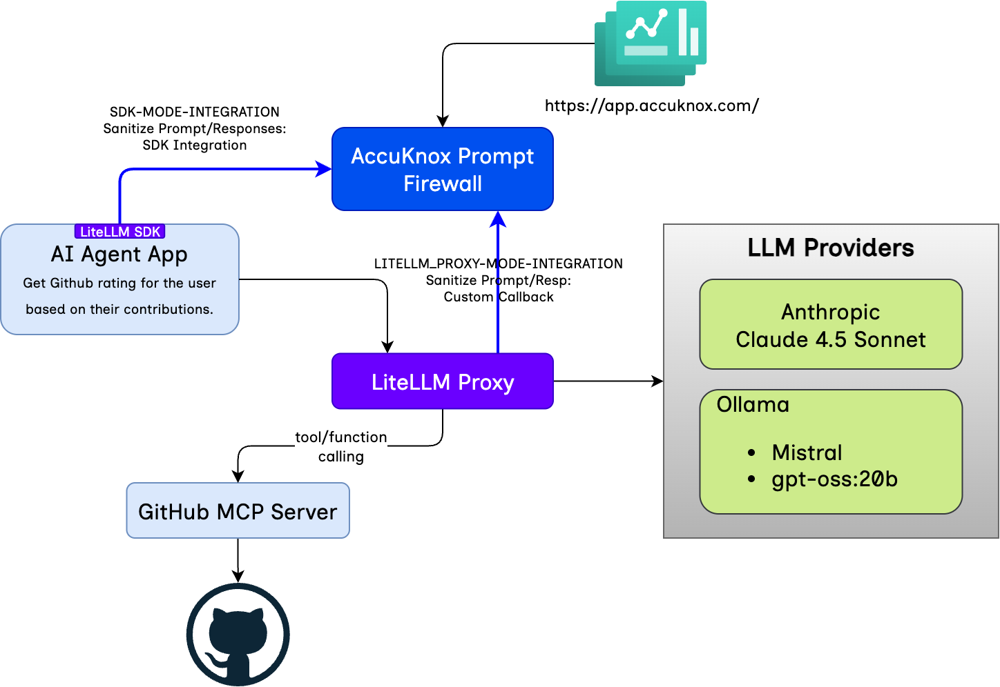

# Prompt Firewall Example

A example repository that demonstrates how to combine an LLM client (`litellm`) with a prompt / response scanning middleware (`accknox-llm-defense`) and GitHub MCP tools to safely call models that may use external tools.

This project includes a minimal runnable script, `prompt-firewall/app.py`, which:

- Shows how to sanitize a user prompt with Accuknox LLM Defense before sending it to an LLM.
- Invokes an LLM (via `litellm`) configured to use GitHub MCP tools.
- Scans the model's response with Accuknox LLM Defense and prints a structured output and usage details.

## Prerequisites

Before running the example, make sure you have the following installed and configured:

1. Python 3.10+
2. pip (the Python package installer)
3. Python packages used by the example:

```bash
pip3 install litellm accuknox-llm-defense
```

4. Required environment variables (set these in your shell):

```bash
export ACCUKNOX_API_KEY="your_accuknox_api_key"
export ANTHROPIC_API_KEY="your_anthropic_api_key" # Needed for litellm.
```

Notes:
- Replace `your_accuknox_api_key` and `your_anthropic_api_key` with real API keys for those services. [How to get ACCUKNOX_API_KEY?](https://help.accuknox.com/use-cases/llm-defense-app-onboard/)
- Keep API keys secret — do not commit them to source control.

## Quick start (run the example)

1. Clone or open this repository and ensure the prerequisites above are met.
2. From the repository root, run:

```bash
python3 prompt-firewall/app.py
```

You should see the script initialize the Accuknox LLM Defense client, sanitize the prompt, invoke the LLM, then print a structured response and token usage details.

## Configuration

- The script uses a few settings at the top of `prompt-firewall/app.py`:
	- `prompt` — the example prompt sent to the sanitizer and model.
	- `accknox_enable` — toggle to enable/disable Accuknox scanning.

If you want to try different models or messages, edit the `completion(...)` call inside `prompt-firewall/app.py`.

## Example output

The script prints a clear section labeled "RESPONSE DETAILS" followed by the sanitized model content and token counts. If Accuknox blocks the prompt or response, the script will print the block reason and exit.

## Troubleshooting

- KeyError when initializing Accuknox client: confirm `ACCUKNOX_API_KEY` is set in your environment.
- ImportError for `litellm` or `accknox_llm_defense`: ensure the packages are installed in the active Python environment.
- Network/API errors: verify your API keys, network connectivity, and any rate limits for the services you call.

## Security & privacy notes

- This example sends prompts and model responses to third-party services (the model provider and Accuknox). Do not use this repository with private or sensitive data unless you understand and accept those risks.
- Treat API keys like secrets. Use environment variables, secrets managers, or vaults in real deployments.

## Contact

If you have questions about this example, open an issue in the repo or contact support@accuknox.com

